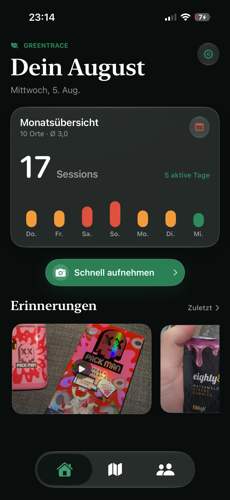
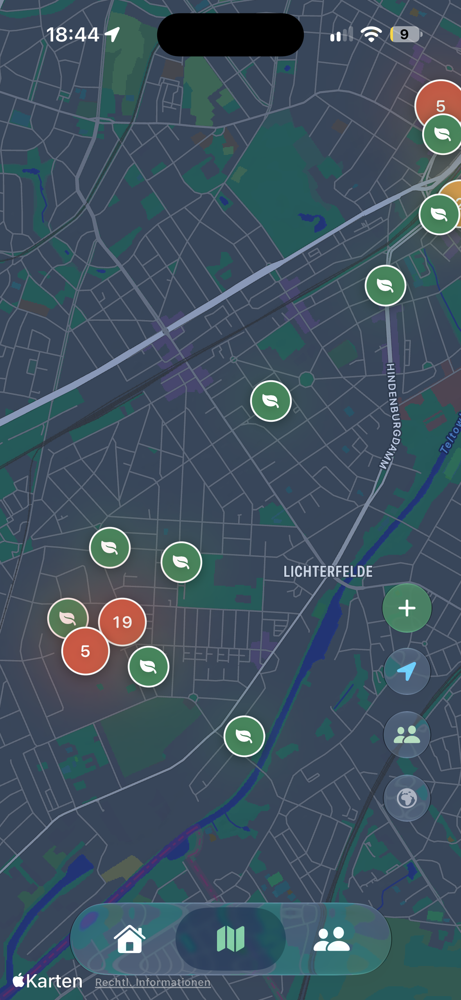
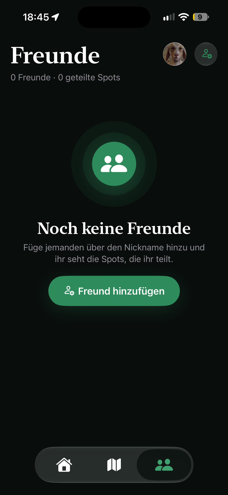

# GreenTrace

GreenTrace is an iOS app for adults that lets you privately document personal cannabis sessions, revisit them on a map, and optionally share them with friends. A dedicated quit mode also helps you visualize breaks from consumption and personal milestones.

## Screenshots

### Monthly overview

### Map

### Friends

## Planned features

- Sessions with location, strain, duration, rating, mood, and notes
- Photos, videos, and voice notes for personal entries
- Map view and memory gallery
- Selected social features with controlled visibility
- Quit mode with statistics and milestones
- Widgets, deep links, and premium features

## Status

GreenTrace is in active development. An iOS release is planned; more information and an App Store link will follow.

The source code is not public during development. This repository serves solely as a project showcase.

## Notice

GreenTrace is intended exclusively for adults. The app is neither medical advice nor an encouragement to consume cannabis.
